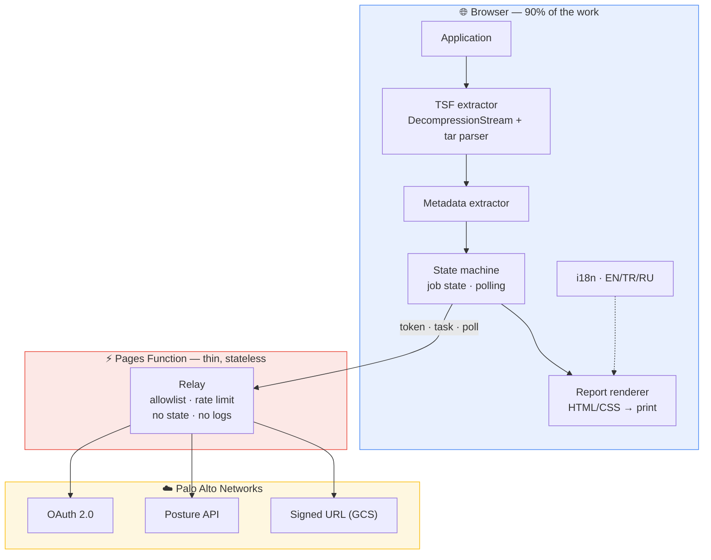
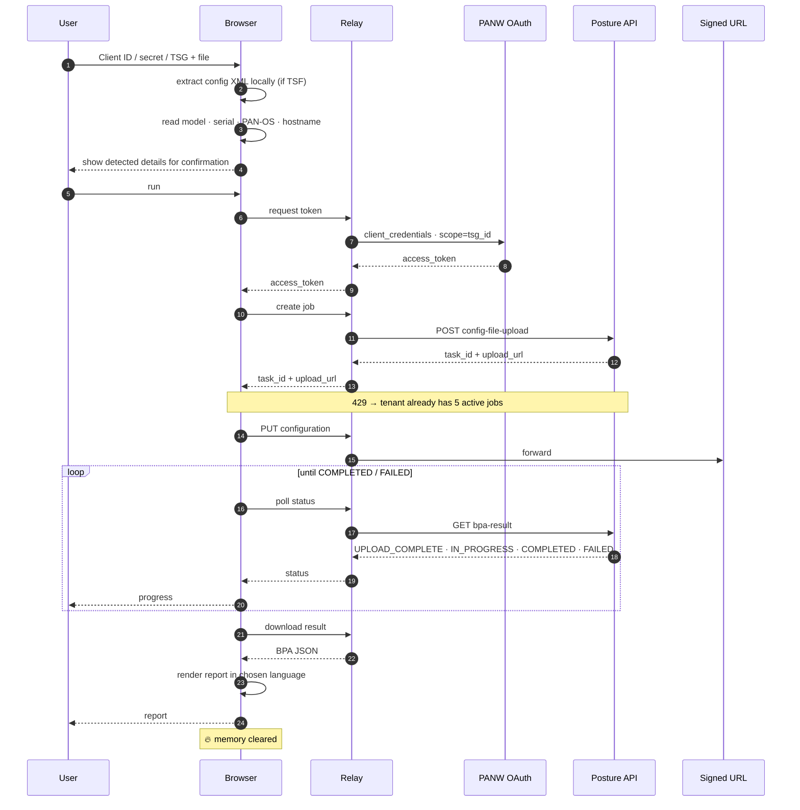

# BPA Report Tool — Architecture

> A web application that produces a **PDF Best Practice Assessment report** from a Tech
> Support File or configuration export, via the Palo Alto Networks Strata Cloud Manager
> **Posture API** — without the user having to touch the API.

**Version:** 0.4 · **Last updated:** 17 August 2026

---

## 1. Purpose and context

The legacy "On-Demand BPA" dashboard was retired on 30 April 2026 and replaced by the
Posture API. The API is capable but operationally awkward: service account, OAuth, signed
URL, polling, raw JSON. What a field engineer needs hasn't changed: **give it the file, get
the report.**

**Context:** built by a channel systems engineer as a convenience for partners.
**Budget: zero** — this is treated as a design input, not a limitation.

### What it adds over the raw API

| | Legacy On-Demand BPA | Raw Posture API | This tool |
|---|---|---|---|
| Input | Upload a TSF | Configuration XML only | **TSF or configuration XML** |
| Device metadata | Automatic | Typed by hand | **Extracted from the file** |
| Output | HTML/PDF | Raw JSON | **Report (EN / TR / RU)** |

---

## 2. Locked decisions

| Decision | Choice | Why |
|---|---|---|
| **Authentication** | BYO credentials — the user supplies their own Client ID / secret / TSG | The Posture API accepts no anonymous calls. A shared service account would put every user behind the **5 concurrent jobs per tenant** limit, and would mean third-party configurations being processed under our tenant — a liability we don't want. |
| **User accounts** | None. No login, no registration, no user database | Authentication is delegated entirely to PANW. No identity data is created on our side. |
| **Who holds state** | **The browser** | Keeps the server stateless and short-lived, which is what makes free hosting viable. |
| **Server role** | A **relay only** | Required by the CORS findings in §3.1 — but nothing more than that. |
| **Data retention** | Zero persistence | No database, no disk, no object storage at any layer. |
| **Output** | Branded report (executive summary + detail), EN/TR/RU | — |
| **Stack** | TypeScript-flavoured plain JS (browser + Pages Function) | One language, one repo, zero cost |
| **Distribution** | Hosted URL **and** container image | Same codebase, two trust levels |

### What must be said plainly to users

We don't store anything — **but Palo Alto does.** The configuration is uploaded via a signed
URL into PANW's own storage bucket and stays there. That is inherent to the Posture API, not
something this tool adds.

The UI says so explicitly. "Nothing is stored anywhere" would be misleading, and indefensible
under GDPR/KVKK. The honest phrasing is: **"This tool stores nothing. Your configuration is
uploaded to Palo Alto Networks, into your own tenant, for analysis."**

---

## 3. The two findings that shaped the architecture

### 3.1 CORS measurement — a relay is mandatory

Measured 14 August 2026:

| Endpoint | Finding | Result |
|---|---|---|
| `auth.apps.paloaltonetworks.com/oauth2/access_token` | **No** `access-control-*` headers at all | ❌ No CORS |
| `api.strata.…/config-file-upload` (OPTIONS) | Returns 200, but the response contains `access-control-**request**-method` — that is an echo of the *request* header, not a valid preflight response | ❌ Preflight fails |
| `api.strata.…/bpa-result` (GET, 401) | `access-control-allow-origin` reflects the origin | ⚠️ Unreachable — the `Authorization` header triggers a preflight, which fails |

**Conclusion: a fully static, backend-free application is impossible.** The token exchange is
the first link in the chain and has no CORS at all.

> **Note:** the `200` on preflight is misleading. A valid preflight response must carry
> `access-control-allow-origin`, `-allow-methods` and `-allow-headers`. The gateway passes
> OPTIONS through without treating it as CORS; the browser rejects the response.

**Signed URLs are closed too** (verified end-to-end in the browser, 16 August 2026). Signed
URLs on `storage.googleapis.com` return no CORS headers — neither the configuration upload
(PUT) nor the result download (GET) can be done from a browser. **Both go through the relay.**
That's roughly 170 KB up and 760 KB down per job; bandwidth is unmetered on Cloudflare's free
tier, so there is no cost impact.

**Side finding — data location:** the signed URL bucket was named
`prod-**eu-w3**-spiffy-config-upload`. For the test tenant, configurations are written to an
**EU region**. Useful for GDPR/KVKK conversations, but assume it varies by tenant region and
verify against your own before telling a customer. Signed URL lifetime: 1799 seconds.

### 3.2 Moving state into the browser

The cost of a server wasn't the workload — it was **continuity**: minutes of polling,
in-memory job state, SSE, server-side PDF rendering. All of that means a long-running
container, which means money.

If the browser holds the state instead:

- The browser drives the polling loop → each request is seconds long, no long-lived process
- Job state lives in the tab → no server-side state
- The report is rendered in the browser → no system library dependencies
- The TSF is opened in the browser → no large uploads

What's left for the server is **forwarding requests** — which fits comfortably in a free tier.

---

## 4. High-level architecture



**The core of the design:** there is no persistence at any layer. The browser is the centre
of gravity; the server exists only because CORS forces it to.

---

## 5. End-to-end flow



> The observed status values include **`UPLOAD_COMPLETE`**, which is not in the reference
> guide (it lists QUEUED / IN_PROGRESS / COMPLETED / FAILED). The polling loop treats any
> unrecognised status as "keep waiting", so this caused no problem — but it's a reminder not
> to enumerate statuses exhaustively.

---

## 6. Components

### 6.1 TSF extractor (browser)

The most distinctive part of the tool. The Posture API accepts only configuration XML; we
also accept a TSF and open it **on the user's machine**.

**Approach**
- `File.stream()` → `DecompressionStream('gzip')` → tar parser
- The tar format is a sequence of 512-byte headers; streaming is straightforward
- Once the target is found, the rest of the archive is left unread
- Memory stays low: non-target members are consumed and discarded

**Selection order** (no hard-coded path — layouts can differ between PAN-OS versions)
1. `running-config.xml`
2. `merged-running-config.xml`
3. Any XML whose root element is `<config>`

> **Measured (16–17 August 2026, 13 real TSFs):** the configuration was at
> `opt/pancfg/mgmt/saved-configs/running-config.xml` in **every one**, across PA-220,
> PA-3420, PA-3440, PA-5430, PA-5440, PA-7500 and PA-VM, on PAN-OS 10.2, 11.1, 11.2 and 12.1,
> including hardware, virtual and an HA pair.

**⚠️ The selection order is not negotiable.** Real TSFs contain **dozens** of XML files with a
`<config>` root: `candidatecfg.177.xml` (20 MB), `last-candidatecfg.xml`,
`refreshed-candidatecfg.*`, `template-config.xml`, `panorama_pushed/*`,
`techsupport-saved-currcfg.xml`.

**The dangerous one:** `.ha-remote-rc.xml` and `.ha-remote2-rc.xml` are the **HA peer's**
configuration — a *different device* — at almost exactly the same size as the real one
(6624 KB vs 6627 KB). "Take the first XML with a `<config>` root" would hand the customer a
report **for the wrong device**: the worst kind of failure, because it looks entirely
plausible.

Also note `.merged-running-config.xml` arrives with a **leading dot**; a filename comparison
that doesn't strip it will never match the preference list.

#### Early exit — 140× faster

`running-config.xml` is the top preference; nothing can beat it. Once it and the system-info
file are both in hand, scanning stops.

The gain varies because the position of those files in the archive isn't fixed — measured
between 1.7% and 96% of the way through. Worst case there's no gain; best case it's dramatic:

| File | Compressed | Without early exit | With early exit |
|---|---:|---:|---:|
| Archive A | 1021 MB | 9.62 GB · 2515 files · 36.7 s | **0.17 GB · 27 files · 262 ms** |
| Archive B | 999 MB | 9.21 GB · 2428 files · 37.4 s | **0.16 GB · 27 files · 208 ms** |

#### Decompression limits — re-derived from measurement

The original **8 GB** ceiling **rejected five of the thirteen real TSFs** (they expand to
8.94 / 9.12 / 9.21 / 9.62 GB). The ceiling was raised to 32 GB and a **ratio check** added
alongside it: measured real expansion ratios are 8–20×, so a 150× ceiling leaves ample room
for genuine files while still catching a zip bomb. An absolute ceiling alone would let a
small but extremely compressed file exhaust memory.

**Security and robustness**
- Only the target member is read; nothing is written to the filesystem
- Symlink and device members are rejected
- **Type detection uses the magic bytes (`1f 8b`), not the extension.** Files arrive with
  unexpected extensions in the field; a non-gzip input must be rejected with a clear message
  rather than a confusing tar error

> **Privacy benefit — the strongest thing to say about this tool:** a TSF contains logs, core
> dumps, dp-monitor output and user data. Because extraction happens in the browser, **none
> of it leaves the machine.** Only the configuration XML is sent — measured at 0.10% to 8% of
> the file depending on device. Compared to the old "upload the whole TSF" flow this is a
> real, measurable improvement.

#### ✅ Verified in the browser — the keystone of the design

This was the riskiest assumption behind the zero-cost architecture.

| | Python prototype | **Browser** |
|---|---:|---:|
| Time (167 MB / 1.65 GB) | ~2000 ms | **873 ms** |
| Throughput | ~830 MB/s | **~1900 MB/s** |
| Metadata | complete | **complete** |

Across all 13 real TSFs: **13/13 succeeded, zero failures, metadata complete in every case**,
6.4 GB of archives processed in 13.2 s total.

**The critical implementation detail — `ByteQueue.skip()` does not copy.** Nearly all of a
TSF is skipped; a naive "concatenate the buffer" approach is O(n²) and locks up the tab. Only
the ~8 MB actually read is materialised.

### 6.2 Metadata extractor (browser)

The reference guide has the user type `family`, `model`, `serial` and `version` by hand.
**Measurement showed all of them can be extracted from a TSF — no manual entry at all.**

**Authoritative source:** the `> show system info` block inside
`tmp/cli/techsupport_<hostname>_<YYYYMMDD>_<HHMM>.txt`.

| Field | From TSF | From configuration XML |
|---|---|---|
| PAN-OS version | ✅ `sw-version` | ❌ **not present** — see trap 1 |
| Serial number | ✅ | ❌ (device state, not configuration) |
| Model | ✅ | ❌ |
| Family | ✅ **directly** | ❌ |
| Hostname | ✅ | ✅ `deviceconfig/system/hostname` |

#### Three measured traps

**1. `<config version="…">` is not the PAN-OS version.** It is the configuration schema
version. On one measured device the schema said `11.2.0` while the real `sw-version` was
`11.2.7-h8`. Sending this value to
the API as `version` could cause the wrong best-practice set to be applied — and that would
be almost impossible to notice.

**2. The first `<ip-address>` in the configuration is not the management IP.** A naive regex
returned the address of an arbitrary interface rather than the management address.
A targeted path (`deviceconfig/system/ip-address`) is required.

**3. Searching logs for `serial:` is unreliable.** The measured TSFs contained other serial
numbers in log files that did not belong to the device. Only the `show system info` block is
treated as authoritative.

#### `family` is read from the device, never derived

The derivation rule ("leading digits + 00") was **wrong twice** across 13 real TSFs:

```
PA-3440 → 3400   ✓ rule holds
PA-445  → 400    ✓ rule holds
PA-220  → 220    ✗ rule produces "200"
PA-5430 → 5400f  ✗ rule produces "5400" — the device appends an "f"
```

The `5400f` value **was accepted by the API**, confirming that reading from the device is
correct. When only a bare configuration XML is supplied, the derived value is flagged
`familyGuessed` so the UI can ask the user to confirm rather than sending a guess silently.

### 6.3 State machine (browser)

The whole job lifecycle lives here: credentials, configuration bytes, task ID, status,
progress. All of it in tab memory. `sessionStorage`/`localStorage` are **not used** —
credentials must not touch disk. Closing the tab loses everything; that is the design, not a
defect.

Polling uses exponential backoff (2s → 5s → 10s → 15s cap) with a ~15 minute overall timeout.

**Token lifetime is 899 seconds**, so the client refreshes it with a 90-second margin and, on
a 401, force-refreshes and retries.

### 6.4 Relay (Pages Function)

**One job:** forward requests to allow-listed PANW endpoints.

**Hard rules**
- **Target allowlist** — only `auth.apps.paloaltonetworks.com`,
  `api.strata.paloaltonetworks.com` and PANW's signed-URL host. It must never be an open proxy
- No request or response body is ever logged
- No credentials, tokens or signed URLs are logged
- No state, no cache, no KV
- **IP rate limiting is mandatory** — see §9

**Why so dumb:** the less the relay does, the smaller the trust surface.

### 6.5 Report renderer (browser)

**Approach:** BPA JSON → HTML/CSS (`web/lib/report.js`) → the browser's own print engine
(`window.print()` → "Save as PDF").

**Why not `@react-pdf/renderer`:** there was already a verified A4 layout built on CSS Paged
Media. Rebuilding it in a PDF library's own layout API would be re-creating something that
already worked. The browser's print engine handles typography and page breaks correctly with
zero external dependencies. The cost is one click by the user.

> **Unexpected benefit:** the architecture originally flagged Cyrillic font embedding as the
> most commonly missed detail. With print-based output that problem disappears entirely — the
> system font already covers Cyrillic and there is nothing to embed.

#### Measured JSON schema

> Source: 4 real devices, 462 to 30,649 checks.

```
best_practices/          device · network · policies · objects
  <config_type>[]        e.g. security_rule, url_filtering_profile
    configuration/       the affected object itself (name, location, …)
    warnings[]           the checks
update_timestamp · version · config_version
information/             device metadata + security_rule_stats
```

**Check object fields** (present on every check):

| Field | Type | Note |
|---|---|---|
| `check_id` | int | **Stable key** — used for grouping and for translations |
| `check_name` | string | Short title (EN) |
| `check_message` | string | Long remediation text (EN) |
| `check_type` | string | **This is the real severity** → Critical / High / Warning / Informational |
| `check_passed` / `check_excluded` | bool | Status is derived from these two |
| `defined_by` | string | Always `Predefined` in every measurement |
| `severity` | string | ⚠️ **Always empty** — do not use |
| `remediation` | null | ⚠️ **Always null** — the guidance is in `check_message` |
| `failed_fields` | dict | Present on a subset; shows which fields failed |

#### Five measurements that shaped the report

**1. There is no overall score in the JSON — it must be computed.** The recommended formula
is `passed / (passed + failed)`, with excluded checks left out of the denominator.

**2. Severity comes from `check_type`, not `severity`.** The `severity` field is empty on
every check; reading the wrong field yields a report with no severity at all.

**3. A single `check_id` can repeat and inflate the report.** In one measurement `#350`
appeared four times with "objects" `shared`, `decryption_rulebase`, `predefined` and `vsys1`
— not four findings, but location variants of one. **Detail must be grouped by `check_id`**,
with affected objects listed underneath.

**4. Remediation text is long prose.** `check_message` can exceed 1000 characters for a single
check. It doesn't fit a table column — it needs a card layout.

**5. ⚠️ Raw non-compliance counts are misleading — the summary must count DISTINCT findings.**

| Device | Rules | Raw non-compliant | **Distinct findings** | Largest single finding |
|---|---:|---:|---:|---:|
| A | 16 | 152 | **79** | 7× |
| B | 227 | 1,231 | **86** | 226× |
| C | 1,632 | 1,719 | **112** | 686× |
| D | 2,334 | 2,531 | **86** | **1827×** |

The raw count grows 17-fold while **distinct findings stay between 79 and 112.** On device D
a single check (`#208` — allow rules without App-ID) affects 1,827 rules; the top three
checks account for **93%** of all non-compliant results.

Telling a customer "2,531 non-compliances" paints a catastrophe and is wrong. The accurate
statement is **"86 distinct issues, the largest affecting 1,827 rules."** The executive
summary cards were rebuilt accordingly (*Distinct findings · Critical findings · Affected
objects · Compliant*), with an automatic explanatory note when the skew is meaningful (top
three ≥ 50%).

**Consequence:** the findings section is naturally bounded. Because it groups by `check_id`,
it stays at roughly 80–120 cards no matter how large the device is. No truncation needed
there.

#### ⚠️ Scale — the single most important constraint on the report

The first measurement device had 16 rules; **a real enterprise firewall has thousands** (the
largest measured: 2,334). Any section that prints one row per rule becomes an unreadable
25-page table and takes over the report.

Unbounded data sets: security rules, zones, security profiles, decryption rules, and the list
of objects a single check failed on.

**Rule: no section may grow linearly with input size.** Three strategies are used:

| Strategy | Where |
|---|---|
| **Threshold behaviour** — full list when small, summary when large | Rule matrix (≤45 rules full matrix, above that pattern analysis) |
| **Pattern grouping** — items sharing the same gaps collapse to one row | Control gap patterns |
| **Ranked truncation** — top N by risk/severity, rest as "+N more" | Highest-risk rules (25), zones (25), profile names (12), affected objects (24) |

**Why pattern grouping isn't just a space-saving trick:** remediation is done per pattern, not
per rule. "116 rules missing profile and App-ID" is *one action* — define a profile group and
apply it to all of them. 116 separate rows makes that action invisible.

> **Verified:** with a 1,200-rule synthetic configuration (15,854 checks) the report stayed at
> **13 pages / 139 KB**, rendering in **78 ms**. With a real 2,334-rule configuration (30,649
> checks, 22.7 MB JSON) it was **13 pages**, parsed in 286 ms and rendered in **157 ms**. Page
> count does not grow with input.

For anyone who wants the full per-rule listing, the answer isn't the report — it's a
**CSV/Excel export**.

**Report structure**
1. **Cover** — branding, device name, model, PAN-OS, date
2. **Executive summary** — computed score, distinct/critical findings, severity × status,
   `security_rule_stats`, skew note
3. **Where issues concentrate** — every assessed configuration area in one chart
4. **Rule coverage** — full matrix or pattern analysis + highest-risk rules, by size
5. **Zone posture and profile inventory**
6. **Priority findings** — critical, grouped by `check_id`
7. **Findings by area** — device / network / policies / objects
8. **Appendix** — scope, method, disclaimer

### 6.6 i18n — EN / TR / RU

Two distinct layers, not to be conflated:

**(a) Application text** — UI, report headings, section names, chart labels. Held in resource
objects for all three languages.

**(b) Check content** — `check_name` and `check_message` come from PANW in **English only**.
The approach is a hand-curated dictionary keyed by `check_id`, with anything unmapped falling
back to English.

> **Measurement settled the dictionary size:** across four real devices, all checks reduce to
> **211 distinct `check_id` values**. Individual devices ranged from 162 to 209. Translating
> the checks is therefore a bounded, manageable task — the assumption the design rested on
> holds.

---

## 7. Technology

| Layer | Choice | Why |
|---|---|---|
| Frontend | Plain ES modules, no framework | Single page, no build step, nothing to keep up to date |
| TSF extraction | `DecompressionStream` (native) + custom tar parser | No dependency; tar parsing is a few hundred lines |
| XML | Targeted string/regex extraction | No full DOM — only metadata is read |
| Report | HTML/CSS + `window.print()` | Verified A4 layout reused as-is; no external library |
| Relay | Cloudflare Pages Function | Free, global, stateless, thin |
| Hosting | Cloudflare Pages | Free, unlimited bandwidth, `*.pages.dev` domain included |
| Local option | Container image (GHCR) | Free; the relay runs on the partner's own machine |

**Why not a framework:** the application is one page with a linear flow. A framework would add
a build step, a dependency tree and update pressure without changing what the user sees.

---

## 8. Functional requirements

**Required**
- F1 — Client ID / secret / TSG entry; none of it stored
- F2 — `.xml`, `.tgz`, `.tar.gz` upload (drag and drop)
- F3 — Configuration XML extracted from the TSF **in the browser**
- F4 — Device metadata auto-detected, user-correctable
- F5 — Full Posture API flow (token → job → upload → poll → result)
- F6 — Live progress
- F7 — Branded report in EN/TR/RU
- F8 — All data cleared from memory when the job ends
- F9 — Clear, actionable error messages
- F10 — In-app service account guide
- F11 — Data-flow transparency text

**Later**
- F12 — Raw JSON download
- F13 — Excel/CSV detail export
- F14 — Panorama configuration support
- F15 — Compare two reports (before/after)
- F16 — Batch upload

---

## 9. Security and privacy

This tool handles **firewall configurations and live API credentials**. Security is not a
secondary heading; it is the product.

### Credential handling
- Held only in tab memory; `localStorage`/`sessionStorage`/cookies **are not used**
- The relay **sees credentials in transit** — it does not store or log them, but it does see
  them (§11)
- Signed URLs are credential-equivalent → never logged, never displayed

### Relay
- **Target allowlist mandatory** — never an open proxy
- **IP rate limiting mandatory.** An open gateway to PANW's auth endpoint could be abused for
  credential stuffing. Failed token attempts are limited separately and more tightly.
  Verified live: attempts 1–8 return `400` (~190 ms, reaching PANW); from the 9th onward
  `429` in ~60 ms — **stopped at the edge, never reaching Palo Alto**
- Bodies are never logged; only counter-level metrics

### Client
- Strict CSP; **no inline script** (the app script is a separate file, so `script-src 'self'`
  holds). A cross-site scripting flaw would not be able to execute injected script.
- Decompression-bomb and malicious-tar protection
- No third-party scripts on the upload page, analytics included

---

## 10. Non-functional requirements

| Concern | Target |
|---|---|
| End to end | Configuration to report < 5 min (bounded by PANW processing) |
| TSF extraction | Under 1 s for a 1 GB archive (measured: 873 ms for 167 MB / 1.65 GB) |
| Accessibility | WCAG 2.1 AA |
| Browser | Requires `DecompressionStream` → Chrome/Edge 80+, Firefox 113+, Safari 16.4+. Unsupported browsers get a clear warning and the configuration-XML path stays open |
| Observability | Counter metrics only. Configuration content, credentials and hostnames **never** |
| Cost | **0** |

---

## 11. Transparency — what the user is told

Three things are stated plainly in the UI. None of them are hidden.

1. **"This tool stores nothing."** — True. No persistence at any layer.
2. **"Your configuration is uploaded to Palo Alto Networks, into your own tenant."** — We
   don't retain it, but PANW does; the file is written to PANW storage via a signed URL.
   "Nothing is stored anywhere" would be misleading.
3. **"Your credentials pass through our relay."** — A technical necessity on the hosted
   version (§3.1). Anyone who objects can run the **container image** instead, in which case
   the relay is on their own machine.

> A partner's security team will ask all three of these questions. Answering them up front,
> in writing, is better than being asked later.

---

## 12. Open items

| # | Question | Why it matters | Status |
|---|---|---|---|
| **R1** | Does the Posture API require SCM Essentials or Pro? | If Pro were required, the BYO-credential model's audience narrows sharply | ✅ **Closed** — worked end to end with a single service account; no extra licence demanded. *Measured on one tenant* |
| **R2** | Correct `Content-Type` / `Content-Encoding` for upload | The reference guide declares `Content-Encoding: gzip` while sending **uncompressed** bytes. Wrong choice uploads a corrupt file silently | ✅ **Closed** — the documented combination is correct; produced a valid 462-check report |
| **R3** | Do signed URLs allow CORS? | Determines whether upload goes direct or through the relay | ✅ **Closed — fully closed.** Both PUT and GET are blocked from a browser. A `tryDirect` flag remains in the code should PANW ever enable bucket CORS |
| **R4** | What `family` values does the API accept? | A wrong value gets the job rejected | ✅ **Closed.** Every device-reported value was accepted, `5400f` and `vm` included. **Read from the device; derivation abandoned** |
| **R6** | TSF layout and metadata source | Defines the extractor's scope | ✅ **Closed with broad coverage.** 13 real TSFs: PA-220 / 3420 / 3440 / 5430 / 5440 / 7500 / VM, PAN-OS **10.2 · 11.1 · 11.2 · 12.1**, hardware + virtual + HA pair. Paths identical in all of them |
| **R6b** | Do real TSFs exceed the decompression ceiling? | If so, files are rejected | ✅ **Closed — they did.** The 8 GB ceiling rejected 5 files (up to 9.6 GB). Now 32 GB plus a 150× ratio check |
| **R11** | Token expires in 899 s; longer jobs would 401 | Long jobs would fail to produce a report | ✅ **Closed** — the client refreshes with a 90 s margin and force-refreshes on 401 |
| **R5** | Minimum service account role | The reference guide suggests Superuser; most organisations will refuse. Matters for adoption | 🟡 **Open** |
| **R8** | BPA JSON schema stability | The reference guide warns the schema may change | 🟢 Schema validation layer |
| **R10** | Input may not be gzip | Observed once: a browser-wrapped download (`.tgz_tw`). Frequency unknown | 🟢 **Defended** — type detection by magic bytes with a clear message |
| **RU** | Russian translation accuracy | Completeness verified programmatically | 🟡 **Open** — needs a native-speaker review |

---

## 13. Status

| Phase | State |
|---|---|
| Phase 0 — API validation | ✅ All blockers closed |
| Browser TSF extractor | ✅ Verified against 13 real TSFs |
| Relay | ✅ Live, guard rails verified in production |
| Client flow | ✅ End to end, real enterprise configurations |
| Report renderer | ✅ EN/TR/RU, verified at scale |
| Hosted deployment | ✅ Live |
| Container image | ✅ Published, multi-architecture |
| Excel/CSV export | ⬜ |
| Panorama support | ⬜ |
| Report comparison | ⬜ |

---

## Appendix — references

- Reference document: *"Palo Alto Networks NGFW Best Practice Assessment (BPA) via the
  Posture API"*, JeanPaul Mansour (Crestan International), LIVEcommunity, August 2026
- PAN Developer — Posture API Introduction / Initiate a Configuration Upload / Get BPA
  Processing Status / Getting Started (OAuth) / Service Accounts
- PAN Docs — Add a Service Account through Common Services · Roles and Permissions ·
  Save and Export Firewall Configurations
